# !INTRODUCTION PAGE!
----
## MY DEVELOPER BACKGROUND

 
Hello I am Josh, I use the name Lunavia online as my developer name! I'm 18, turning 19 in like a couple weeks (October 4th) and I studied Sociology, English Literature and Computer Science at A Level.

Currently I am a part time developer for my own indie games studio INNERMINDS founded by myself and two of my closest friends back in Year 12 of Sixth Form.

Here's our stats on Video Game Insights, not super impressive I know!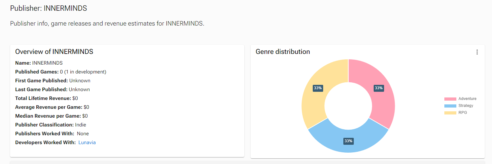

Currently I am working on a game called WITHIN TIME, a turn based JRPG taking inspirations from the classics like Chrono Trigger, Final Fantasy, Dragon Quest and the Persona Series.

The game uses the **GAME MAKER STUDIO 2** engine, same engine that Undertale was developed in. I am entirely self taught when it comes to programming, using documentation provided by GMS and a few youtube tutorials.

The game is expected to be released in the coming years, with a team of 12 working on the game currently including myself.

Here's our Steam page!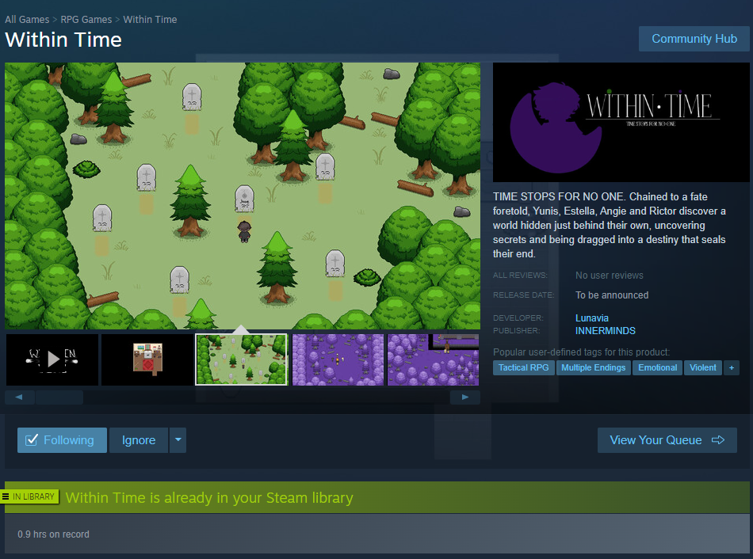

[Here's also a link to the Steam page](https://store.steampowered.com/app/2302230/Within_Time/)

----

## OTHER SKILLS

I am also an artist, having been practicing since I was about 13 and recently picking up the ability to do pixel art in order to be the lead artist on my game's team! I'm very passionate about my own work and also ensuring that my game is a success!

Here's a few examples of my main character's sketches:

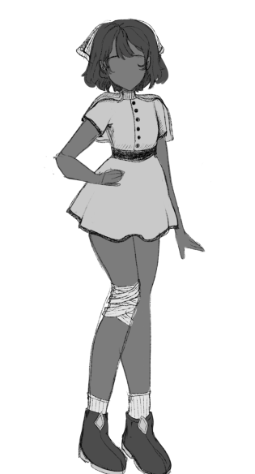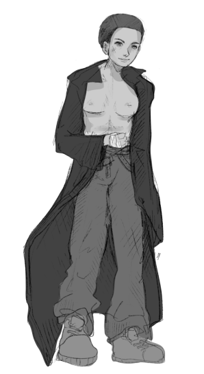 
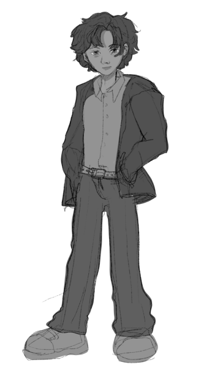

Here's a few examples of my pixel art:

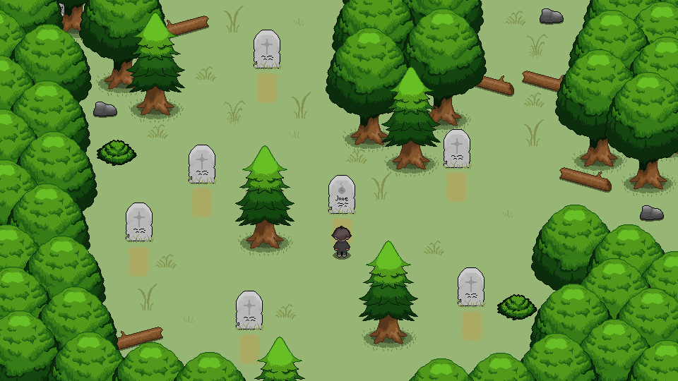
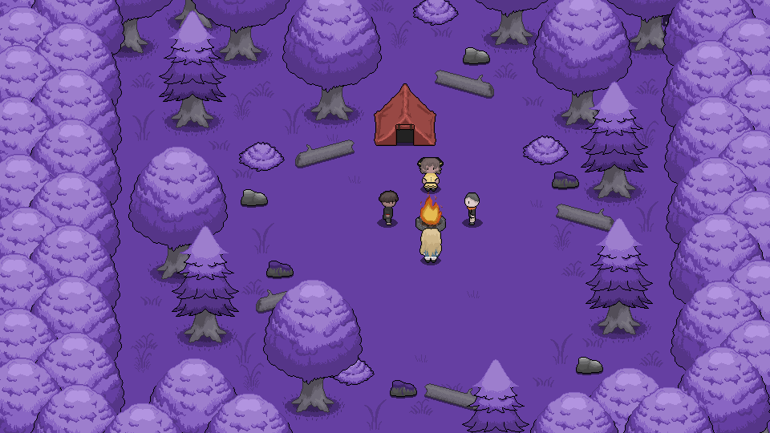
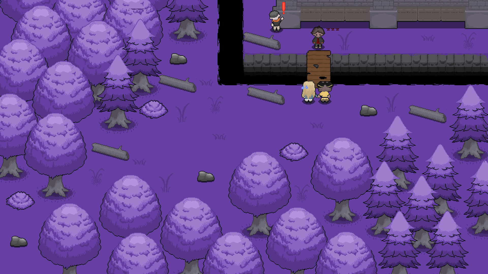
----

## CURRENT INTERESTS

At the moment my general interests are online competitive games, things like League of Legends, Valorant and Dead by Daylight are all games I sink a lot of my time into recently in the hopes to improve drastically. I've also been fairly active in the FGC scene, primarily playing games like TEKKEN 8 and Super Smash Bros, during the Tekken 7 era around 2021, I played semi professionally in Tekken 7 tournaments online and locally after the lockdown had ended. Currently in Tekken 8 I have remained mostly casual due to taking up the responsibility of creating my game but I still play somewhat frequently.

But aside from those games some of my personal favourite games are as follows:

<ol>
    <li>Persona 3 FES/RELOAD
    <li>Until Then
    <li>Octopath Traveller I/II
    <li>Final Fantasy 7
    <li>Xenoblade Chronicles 3
    <li>Dragon Quest XI
</ol>

And many other games that would make the list way too long and I'd be here forever if I were to include like every single game I love.

## BONUS LITTLE THINGS

Here's just a few extra things about me that don't really fit into any of the categories beforehand!

This is my manga / figure collection that I have in my dorm room:
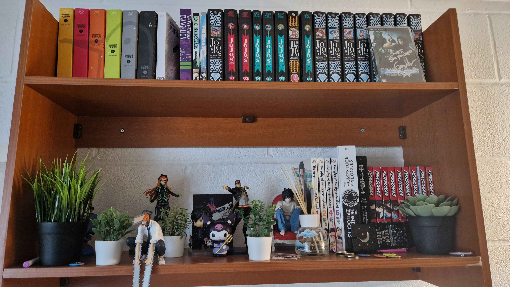

This is my MIDI keyboard that I use to compose music in my free time for my game:
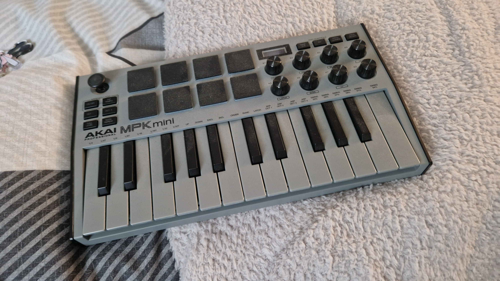

And this is my PC tower if anyone's curious:
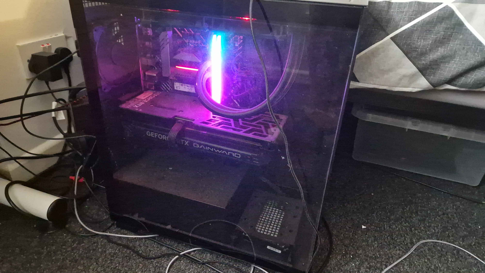
